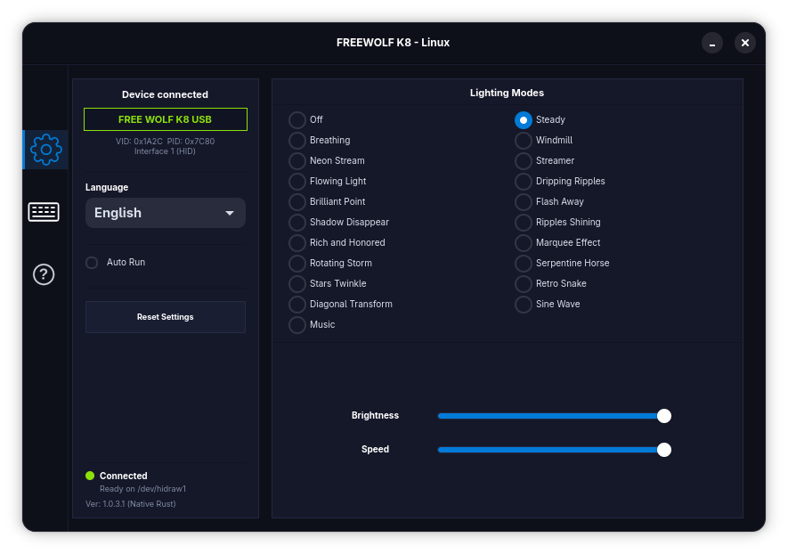
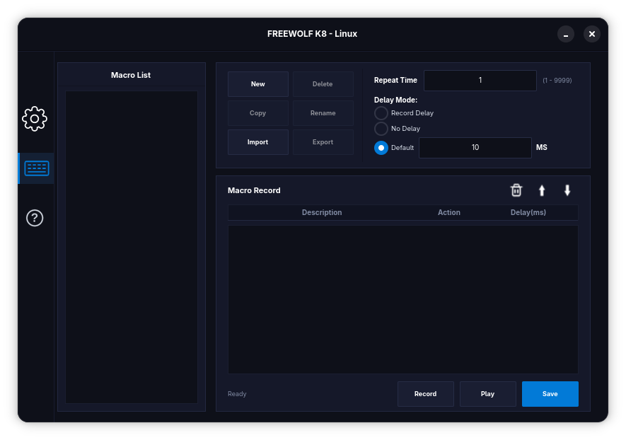

# FREE WOLF K8 — Linux Controller & Driver

[](https://www.rust-lang.org/)
[](https://gtk.org/)
[](https://kernel.org/)
[](LICENSE)

<p align="center">
  
</p>

A high-performance, native Linux driver, graphical configuration studio, and CLI utility for the **FREE WOLF K8** Tri-Mode Mechanical Gaming Keyboard (USB Wired / 2.4 GHz Wireless / Bluetooth 5.0).

Engineered entirely in **Rust** using **GTK4** and **Libadwaita** with a custom dark Argonaut GNOME theme. The application compiles to a **single unified native binary** (`freewolf-k8`) that functions as both a modern desktop GUI and a fast, scriptable terminal CLI.

> [!IMPORTANT]
> **Supported Connection Modes**: The controller application and CLI communicate via USB HID Feature Reports and operate **exclusively over USB Wired Mode (`VID: 0x1A2C`, `PID: 0x7C80`) and 2.4 GHz Wireless USB Dongle Mode (`VID: 0x1A2C`, `PID: 0x7FFF`)**.
> **Bluetooth Mode (BT1, BT2, BT3) does NOT support software configuration** because the keyboard's Bluetooth firmware only exposes standard typing descriptors and isolates vendor feature reports. (Hardware shortcuts like `FN + |`, `FN + ↑/↓`, etc. continue to work normally in all modes).

---

## Screenshots

| Lighting & Device Settings | Macro Recording Studio |
| :---: | :---: |
|  |  |

---

## Highlights

- **Single Unified Binary**: The compiled binary (`freewolf-k8`) seamlessly acts as a graphical interface or terminal CLI based on launch arguments or symlink name (`k8gui` vs `k8ctl`).
- **No Python or Heavy Runtimes**: Zero Python, Node, or Electron dependencies. Clean, compiled native Linux ELF binary with near-instant launch times and minimal RAM usage (~25 MB).
- **Direct Kernel HID Communication**: Direct low-level interaction with keyboard USB HID Feature Reports using native Linux `ioctl(HIDIOCSFEATURE(8))` on `/dev/hidraw*` (Interface 1: `VID: 0x1A2C`, `PID: 0x7C80` / `0x7FFF`).
- **21 Factory Lighting Modes**: Complete support for all factory backlighting patterns, 5-level brightness adjustment (0–4), and 5-level animation speed controls.
- **Dynamic Audio Spectrum Visualizer (Music Mode)**: Equalizer-reactive RGB backlighting synchronized in real-time.
- **Kernel-Level Macro Engine**: Record keystrokes with exact millisecond precision, customize repeat counts and delays, and play back sequences via the Linux kernel `/dev/uinput` virtual device subsystem.
- **Full Multilingual Localization (i18n)**: Fully translated into **5 languages** (English, Português, Español, Français, Deutsch) with live in-app language switching.
- **Built-in Interactive Hardware Manual**: 9 complete topics detailing technical specifications, shortcut keys, pairing, battery care, switch replacement, and troubleshooting.
- **Automated Privilege & udev Management**: Integrated helper to install udev rules for non-root access to `/dev/hidraw*` and `/dev/uinput`.

---

## Compilation & Installation

### 1. Install System Dependencies

Select your Linux distribution below to install the necessary compiler toolchain and GTK4 / Libadwaita development packages:

#### Ubuntu / Debian / Linux Mint / Pop!_OS
```bash
sudo apt update
sudo apt install -y build-essential curl git libgtk-4-dev libadwaita-1-dev
```

#### Fedora / RHEL 9+ / AlmaLinux / Rocky Linux
```bash
sudo dnf install -y @development-tools curl git gtk4-devel libadwaita-devel
```

#### Arch Linux / Manjaro / EndeavourOS
```bash
sudo pacman -S --needed base-devel rust git gtk4 libadwaita
```

#### openSUSE (Tumbleweed / Leap)
```bash
sudo zypper install -t pattern devel_basis
sudo zypper install -y curl git rust cargo gtk4-devel libadwaita-devel
```

#### Void Linux
```bash
sudo xbps-install -Sy base-devel rust cargo git gtk4-devel libadwaita-devel
```

#### Alpine Linux
```bash
sudo apk add build-base rust cargo git gtk4-dev libadwaita-dev
```

---

### 2. Install Rust Toolchain (if not already installed)

If your distribution does not package a recent Rust compiler (Rust 1.80+ / 2024 edition support), install the official Rust toolchain via [rustup](https://rustup.rs/):

```bash
curl --proto '=https' --tlsv1.2 -sSf https://sh.rustup.rs | sh
source "$HOME/.cargo/env"
```

---

### 3. Clone and Build

```bash
# Clone the repository
git clone https://github.com/nodefive/freewolf-k8-linux.git
cd freewolf-k8-linux

# Build the optimized release binary
cargo build --release
```

The resulting compiled binary will be located at:
```bash
target/release/freewolf-k8
```

---

### 4. System-Wide Installation Script (Automated)

The included `install.sh` script automates system-wide installation across GNOME, KDE Plasma, XFCE, and other desktop environments:

```bash
# Install binary to /usr/bin, desktop entry, application icons, assets, and udev rules
sudo ./install.sh -i

# To cleanly remove all installed files:
sudo ./install.sh -u

# Show help:
./install.sh -h
```

### 5. Manual Symlinks (Portable Run)

If you prefer running portably directly from the build directory without system-wide installation:

```bash
ln -sf target/release/freewolf-k8 k8gui
ln -sf target/release/freewolf-k8 k8ctl
```

---

## Device Permissions & udev Configuration

By default, Linux restricts write access to `/dev/hidraw*` device nodes and `/dev/uinput` to the `root` user. To allow your user account to control backlights and playback macros without `sudo`:

### Automated Setup
Run the built-in udev configuration command:
```bash
./freewolf-k8 setup-udev
# Or from the GUI: click "Setup udev" in the bottom status panel
```

### Manual Setup
Alternatively, manually copy the included udev rules file:
```bash
sudo cp 99-freewolf-k8.rules /etc/udev/rules.d/
sudo udevadm control --reload-rules && sudo udevadm trigger
sudo modprobe uinput
sudo usermod -aG input $USER
```
*(Log out and log back in for group membership to take effect).*

---

## Usage Guide

### 1. Graphical User Interface (GUI)

Launch the GUI by running the binary without arguments, or using `--gui` / `k8gui`:

```bash
./freewolf-k8
# or
./k8gui
```

- **Lighting Tab**:
  - Select any of the 21 animated lighting presets.
  - Adjust **Brightness** (0% / Off to 100%) and **Speed** sliders in real-time.
  - Toggle **Auto Run** to restore your preferred lighting preset on user login.
  - Change interface language (English, Português, Español, Français, Deutsch).
  - Perform a **Factory Reset** to return settings and macros to initial defaults.
- **Macro Tab**:
  - Create, duplicate, rename, delete, import, and export macro files.
  - Configure **Repeat Time** (1–9999 cycles) and **Delay Mode** (Record Delay, No Delay, or Fixed Default Delay in ms).
  - Record keystrokes directly into the table, reorder actions, edit delays, and test playback.
- **Help Tab**:
  - Complete 9-topic hardware manual including technical specifications, shortcut mappings, wireless connection pairing, battery care, switch replacement, and troubleshooting.

---

### 2. Command-Line Interface (CLI)

Control your keyboard directly from terminal scripts, hotkeys, or cron jobs:

```bash
# Check device connection status and current hardware node
./freewolf-k8 status

# List all 21 lighting modes with IDs and descriptions
./freewolf-k8 list

# Set lighting by mode name or ID with brightness and speed (0-4)
./freewolf-k8 set -m steady -b 4
./freewolf-k8 set -m neon_stream -b 3 -s 2
./freewolf-k8 set -m 18 -b 4 -s 3

# Turn off backlights (sleep / power saving)
./freewolf-k8 set 0

# Start real-time audio spectrum lighting visualizer
./freewolf-k8 music -m 2 -d 66

# List saved macros
./freewolf-k8 macro list

# Inspect actions in macro #1
./freewolf-k8 macro show 1

# Execute/play macro #1 via Linux /dev/uinput
./freewolf-k8 macro play 1

# Read the built-in manual topics
./freewolf-k8 help
./freewolf-k8 help specs
./freewolf-k8 help shortcuts
./freewolf-k8 help battery

# Configure udev permissions
./freewolf-k8 setup-udev
```

---

## Lighting Modes Reference

| ID | Wire ID | Mode Name | Description |
|:---:|:---:|:---|:---|
| `0` | `0x01` | **Off** | All backlights turned off |
| `1` | `0x00` | **Steady** | Static backlight with adjustable brightness |
| `2` | `0x02` | **Breathing** | Pulsing breathing light rhythm |
| `3` | `0x03` | **Windmill** | Rotating pinwheel light pattern |
| `4` | `0x04` | **Neon Stream** | Smooth flowing neon gradient across keyboard |
| `5` | `0x05` | **Streamer** | Linear streaming rainbow wave |
| `6` | `0x06` | **Flowing Light** | Multi-directional flowing light waves |
| `7` | `0x07` | **Dripping Ripples**| Ripples expanding outward from pressed keys |
| `8` | `0x08` | **Brilliant Point** | Single key illumination upon strike |
| `9` | `0x09` | **Flash Away** | Keys flash instantly and fade out slowly |
| `10`| `0x0A` | **Shadow Disappear**| Trailing shadow fading behind keystrokes |
| `11`| `0x0B` | **Ripples Shining** | Interlocking concentric ripple rings |
| `12`| `0x0C` | **Rich and Honored**| Lush harmonic multi-color transitions |
| `13`| `0x0D` | **Marquee Effect** | Edge perimeter chasing marquee lights |
| `14`| `0x0E` | **Rotating Storm** | Centrifugal cyclone rotating vortex |
| `15`| `0x0F` | **Serpentine Horse**| Chasing horse-race serpentine sequence |
| `16`| `0x10` | **Stars Twinkle** | Random celestial twinkling starfield |
| `17`| `0x11` | **Retro Snake** | Classic retro arcade snake pattern |
| `18`| `0x12` | **Diagonal Transform**| Diagonal sweeping wavefront |
| `19`| `0x13` | **Sine Wave** | Smooth sinusoidal undulating wave |
| `20`| `0x13` | **Music** | Audio visualizer frequency equalizer reactive mode |

---

## Legacy Python System (FreeWolf-K8-Legacy)

For environments where Python is preferred or as a reference implementation, the original Python 3 / Tkinter application is available in the [`FreeWolf-K8-Legacy/`](FreeWolf-K8-Legacy/) directory.

### Requirements to Run the Python Edition

- **Python 3.10+**
- **Tkinter bindings**:
  - **Ubuntu / Debian / Linux Mint**: `sudo apt install -y python3-tk`
  - **Fedora / RHEL**: `sudo dnf install -y python3-tkinter`
  - **Arch Linux / Manjaro**: `sudo pacman -S --needed tk`
  - **openSUSE**: `sudo zypper install -y python3-tk`
- *No additional pip packages required (runs purely on standard library).*

### How to Run the Python Edition

```bash
cd FreeWolf-K8-Legacy

# Configure udev permissions
./setup_udev.sh

# Launch the Tkinter desktop GUI
./k8gui

# Or run terminal CLI commands
./k8ctl status
./k8ctl set steady --brightness 4
./k8ctl music --submode 2 --delay 66
```

For complete details, see [`FreeWolf-K8-Legacy/README.md`](FreeWolf-K8-Legacy/README.md).

---

## Project Architecture

```
freewolf-k8-linux/
├── assets/
│   ├── DeviceDriver.png      # 500x500 high-res application icon
│   ├── icon/                 # Application navigation tab icons
│   ├── keyboard/             # High-res keyboard diagram (kb_102.png)
│   └── screenshots/          # Documentation screenshots (Screen1, Screen2)
├── FreeWolf-K8-Legacy/       # Original Python 3 / Tkinter implementation
│   ├── assets/               # Legacy icon and UI assets
│   ├── freewolf_k8/          # Python driver, GUI, CLI, and macro modules
│   ├── k8ctl                 # CLI launcher script
│   ├── k8gui                 # GUI launcher script
│   └── README.md             # Python edition documentation
├── src/
│   ├── cli.rs                # Command-line interface handler & dispatcher
│   ├── config.rs             # Configuration persistence (~/.config/freewolf-k8)
│   ├── driver.rs             # Linux sysfs discovery & HID Feature Report ioctl
│   ├── gui.rs                # Libadwaita / GTK4 Argonaut-themed user interface
│   ├── i18n.rs               # 5-language localization dictionary
│   ├── macro_mgr.rs          # Macro serialization & /dev/uinput playback engine
│   ├── main.rs               # Dual GUI/CLI entrypoint
│   ├── manual.rs             # Integrated 9-topic hardware documentation
│   ├── music.rs              # Real-time audio spectrum lighting visualizer
│   ├── protocol.rs           # Lighting modes, USB IDs, and packet generators
│   └── udev.rs               # Permission probing, udev rules & elevation helpers
├── 99-freewolf-k8.rules      # Linux udev rules for hidraw & uinput
├── install.sh                # System-wide installer / uninstaller script (-i / -u)
├── setup_udev.sh             # Standalone bash setup script
├── Cargo.toml                # Rust package definition & dependencies
├── Cargo.lock                # Dependency lockfile
└── README.md                 # Project documentation
```

---

## FAQ & Troubleshooting

### Keyboard shows "Permission Denied"
Run `./freewolf-k8 setup-udev` or install `99-freewolf-k8.rules` into `/etc/udev/rules.d/`, reload udev rules, and replug the USB cable.

### Claimed by VM
If running inside a virtual machine (such as QEMU / KVM / VirtualBox) or if the host captured the USB device through `usbfs`, ensure USB pass-through is properly forwarded to your guest OS or release the device on the host.

### Does the app work over Bluetooth?
**No.** Software-level control (lighting effects, sliders, and audio visualizer) only works when connected via the **USB-C cable** or the **2.4 GHz USB wireless receiver dongle**. In Bluetooth mode (BT1, BT2, BT3), the keyboard's Bluetooth firmware only exposes standard keyboard and consumer media keys to ensure universal OS compatibility; it does not bridge the proprietary vendor HID Feature Reports needed for software lighting control. This is a hardware/firmware constraint of the keyboard itself (the official Windows software also requires the USB cable or 2.4 GHz dongle). All hardware hotkeys (`FN + |`, `FN + ↑/↓`, `FN + ~`) work normally in Bluetooth mode.

### Battery Reporting
The FREEWOLF K8 hardware uses an autonomous onboard analog charging circuit. USB wired and 2.4 GHz RF modes do not expose a battery telemetry report to the host OS. Battery status is indicated physically via the dedicated charging LED (illuminates while charging, extinguishes at 100% full capacity) and automatic backlight power-cutoff when battery is low.

---

## License

This project is licensed under the **MIT License**. See [LICENSE](LICENSE) for details.
